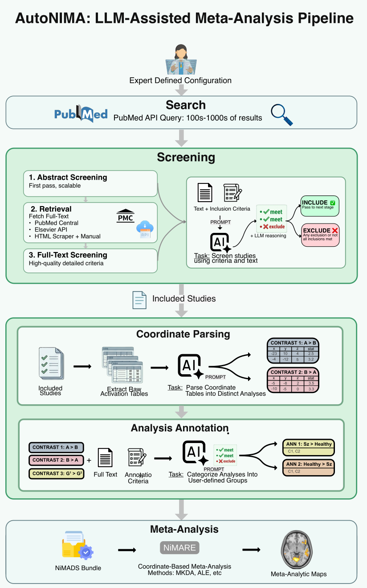

# Autonima

Autonima is a large language model (LLM)-guided framework for neuroimaging
meta-analysis. It automates article screening against expert-defined eligibility
criteria, parses heterogeneous coordinate tables into the distinct analyses that
produced them, and selects individual analyses for quantitative synthesis.

Full documentation: https://neurostuff.github.io/autonima/

## The workflow

<p align="center">
  
</p>

A project is one YAML file: a PubMed query, article-level inclusion and exclusion
criteria, retrieval sources, parsing settings, and one set of contrast-specific
criteria per target.

1. **Search** — PubMed through the Entrez API.
2. **Abstract screening** — an LLM judges each record against the article-level
   criteria, returning a decision, a criterion-by-criterion assessment and its
   reasoning. Abstract criteria are usually more permissive, since an abstract
   carries incomplete information.
3. **Full-text retrieval** — PubMed Central via pubget, publisher text-mining
   APIs (Elsevier, Springer Nature), and user-supplied HTML. Records with no
   usable text are marked unavailable rather than rejected: a retrieval failure
   is not an eligibility decision.
4. **Full-text screening** — the same procedure against the complete criteria,
   with the full text in context.
5. **Coordinate parsing** — heuristics identify candidate tables; an LLM reads
   each table with its caption and footnotes and separates it into the distinct
   statistical analyses it reports, keyed on contrast, direction, group,
   condition, session or any other explicitly labelled dimension.
6. **Analysis selection** — every parsed analysis is evaluated against each
   target's criteria in the context of its article, producing an
   analysis × target inclusion matrix. One analysis may serve several targets.
7. **Meta-analysis** — selected coordinates are written as a NiMADS studyset and
   submitted to NiMARE (MKDA, ALE or KDA; FWE or FDR correction).

Stage outputs are cached, so re-running resumes rather than repeating paid API
calls.

## Two ways to run it

Both drive the same pipeline and produce identical outputs.

**The CLI** runs one config, once, into one folder. Use it for scripted and
reproducible work.

```bash
autonima run config.yaml
```

**The web UI** manages many projects over time — live progress, cancellation,
cloning a project to make a variant, browsing meta-analysis artifacts, and
storing API credentials. Use it while developing criteria.

```bash
autonima ui --workspace .
```

The CLI has no memory between invocations; the UI keeps a workspace. A project
created in one can be run from the other. See the
[Web UI guide](https://neurostuff.github.io/autonima/guides/web-ui/).

## Install

```bash
git clone git@github.com:neurostuff/autonima.git
cd autonima
pip install -e .
```

Extras:

```bash
pip install -e .[llm]          # screening and other LLM-backed workflows
pip install -e .[meta]         # `autonima meta`
pip install -e .[readability]  # enhanced HTML extraction
pip install -e .[ui]           # `autonima ui` local web app
pip install -e .[docs]         # local docs build
```

## Quickstart

```bash
autonima create-sample-config > config.yaml   # a starting config
autonima validate config.yaml                 # check it before spending anything
autonima run config.yaml                      # run the pipeline
autonima meta config/outputs                  # meta-analyse the NiMADS output
```

Omitting `OUTPUT_FOLDER` derives it from the config filename stem, so
`projects/cue_reactivity/default.yaml` writes to
`projects/cue_reactivity/default/`. Pass one explicitly to override:

```bash
autonima run config.yaml runs/my_review
```

`run-search` and `run-abstract` execute the pipeline only as far as those stages,
which is useful for checking a query or a criteria set cheaply before committing
to full-text retrieval.

## Minimal config

```yaml
search:
  database: "pubmed"
  query: "schizophrenia AND working memory AND fMRI"
  max_results: 100

retrieval:
  sources:
    - pubget
  load_excluded: false

screening:
  abstract:
    model: "gpt-5-mini-2025-08-07"
    objective: "Identify fMRI studies of working memory in schizophrenia"
    inclusion_criteria:
      - Human participants
      - fMRI neuroimaging
  fulltext:
    model: "gpt-5-mini-2025-08-07"
    objective: "Identify fMRI studies of working memory in schizophrenia"
    inclusion_criteria:
      - Human participants
      - fMRI neuroimaging

parsing:
  parse_coordinates: false
  coordinate_model: "gpt-4o-mini"

output:
  directory: "results"

annotation:
  enabled: false
```

Model identifiers and API endpoints are configurable, so any OpenAI-compatible
provider can be used.

## Documentation

- [Quickstart](https://neurostuff.github.io/autonima/getting-started/quickstart/)
- [Configuration](https://neurostuff.github.io/autonima/guides/configuration/)
- [CLI usage](https://neurostuff.github.io/autonima/guides/cli/)
- [Web UI](https://neurostuff.github.io/autonima/guides/web-ui/)
- [Full-text sources](https://neurostuff.github.io/autonima/guides/full-text-sources/)
- [Meta-analysis](https://neurostuff.github.io/autonima/guides/meta-analysis/)
- [Interpreting outputs](https://neurostuff.github.io/autonima/guides/interpreting-outputs/)

## Citation

Autonima v0.1.0 is the version evaluated in the AutoNIMA manuscript. See
[releases](https://github.com/neurostuff/autonima/releases).
