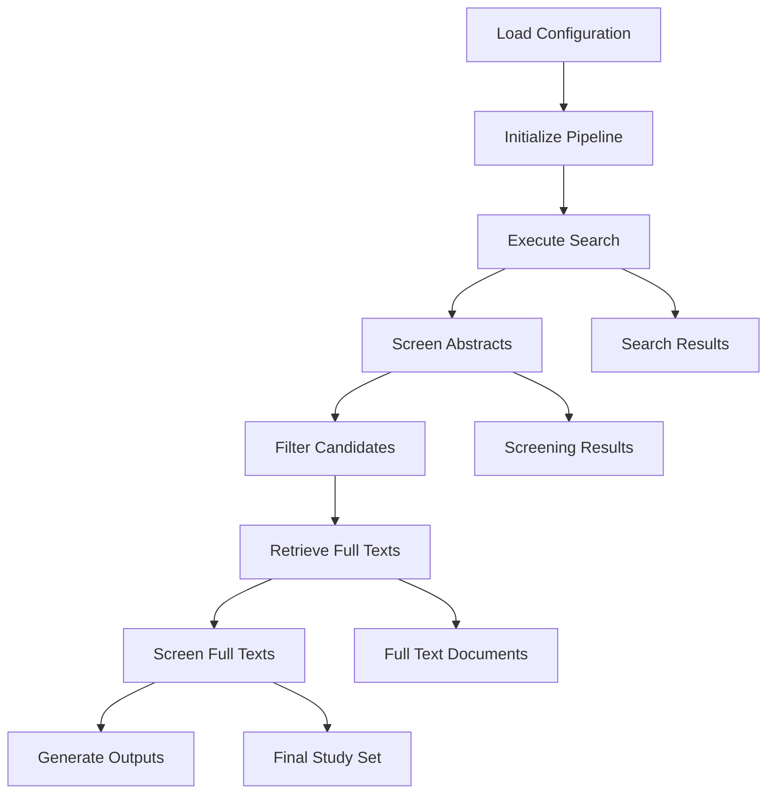

# Autonima Architecture Plan

## Overview

Autonima is an LLM-powered framework for automating systematic literature reviews and meta-analyses in neuroimaging. It follows the PRISMA framework and automates the workflow from literature search to final inclusion of studies.

## Core Architecture

### Package Structure

```
autonima/
├── __init__.py
├── config.py              # Configuration management and validation
├── pipeline.py            # Main pipeline orchestrator
├── cli.py                 # Command-line interface
├── search/
│   ├── __init__.py
│   ├── pubmed.py          # PubMed API integration
│   └── base.py            # Abstract search interface
├── screening/
│   ├── __init__.py
│   ├── base.py            # Abstract screening interface
│   ├── screener.py        # LLM-based screening logic
│   ├── prompts.py         # Prompt library for screening
│   ├── schema.py          # Pydantic models for screening output
│   └── openai_client.py   # Generic LLM API integration
├── retrieval/
│   ├── __init__.py
│   ├── pubget.py          # PubGet integration
│   └── base.py            # Abstract retrieval interface
├── output/
│   ├── __init__.py
│   ├── prisma.py          # PRISMA diagram generation
│   ├── formatters.py      # Output formatters (CSV, JSON, PDF)
│   └── base.py            # Abstract output interface
├── utils/
│   ├── __init__.py
│   ├── logging.py         # Logging configuration
│   └── helpers.py         # Utility functions
└── models/
    ├── __init__.py
    └── types.py           # Type definitions and data models
```

### Key Components

#### 1. Configuration Management (`config.py`)

- **Purpose**: Handle YAML/JSON configuration files with validation
- **Features**:
  - Schema validation using Pydantic or similar
  - Default value handling
  - Environment variable support
  - Configuration inheritance and merging

#### 2. Pipeline Orchestrator (`pipeline.py`)

- **Purpose**: Coordinate the entire systematic review workflow
- **Features**:
  - Step-by-step execution following PRISMA
  - Error handling and recovery
  - Progress tracking
  - Result aggregation

#### 3. Search Module (`search/`)

- **Purpose**: Interface with academic databases (PubMed)
- **Features**:
  - PubMed Entrez API integration
  - Query construction and optimization
  - Result deduplication
  - Metadata extraction (title, abstract, DOI, PMID, etc.)

#### 4. Screening Module (`screening/`)

- **Purpose**: LLM-powered inclusion/exclusion screening
- **Features**:
  - Abstract screening with configurable thresholds
  - Full-text screening with human-in-the-loop options
  - Multi-model support (GPT-4, Claude, etc.)
  - Screening result caching and reproducibility
  - Prompt library for consistent screening
  - Pydantic schemas for structured output
  - Generic LLM API integration with function calling

#### 5. Retrieval Module (`retrieval/`)

- **Purpose**: Download full-text articles
- **Features**:
  - PubGet integration for open-access papers from PubMed Central
  - Fallback mechanisms for paywalled content
  - PDF/text extraction and parsing
  - Support for parallel processing with configurable number of jobs

#### 6. Output Module (`output/`)

- **Purpose**: Generate final deliverables
- **Features**:
  - PRISMA flow diagram generation
  - Multiple output formats (CSV, JSON, PDF)
  - NiMARE dataset compatibility
  - Reproducible report generation

## Data Flow

### Pipeline Execution Flow



### Data Models

#### Study Model
```python
@dataclass
class Study:
    pmid: str
    title: str
    abstract: str
    authors: List[str]
    journal: str
    publication_date: str
    doi: Optional[str]
    keywords: List[str]
    status: StudyStatus  # INCLUDED, EXCLUDED, PENDING
    abstract_screening_reason: Optional[str]
    fulltext_screening_reason: Optional[str]
    metadata: Dict[str, Any]
```

#### Configuration Model
```python
@dataclass
class PipelineConfig:
    search: SearchConfig
    screening: ScreeningConfig
    retrieval: RetrievalConfig
    output: OutputConfig

@dataclass
class ScreeningConfig:
    abstract: Dict[str, Any] = field(default_factory=lambda: {
        "model": "gpt-4",
        "threshold": None,
        "confidence_reporting": False,
        "objective": None,
        "inclusion_criteria": None,
        "exclusion_criteria": None,
        "additional_instructions": None,
    })
    fulltext: Dict[str, Any] = field(default_factory=lambda: {
        "model": "gpt-4",
        "threshold": None,
        "confidence_reporting": False,
        "objective": None,
        "inclusion_criteria": None,
        "exclusion_criteria": None,
        "additional_instructions": None,
    })
```

## Implementation Strategy

### Phase 1: Core Infrastructure
1. Set up package structure and imports
2. Implement configuration management
3. Create base interfaces and abstract classes
4. Set up logging and error handling

### Phase 2: Core Functionality
1. Implement PubMed search functionality
2. Create basic screening stub (no LLM yet)
3. Implement file-based retrieval (mock)
4. Build output formatting system

### Phase 3: LLM Integration
1. Implement LLM screening with generic API client
2. Add support for multiple LLM providers
3. Implement screening result caching
4. Add confidence scoring and thresholds
5. Implement prompt library and Pydantic schemas

### Phase 4: Advanced Features
1. Integrate with PubGet
2. Implement PRISMA diagram generation
3. Add PDF processing capabilities
4. Implement benchmarking framework

### Phase 5: Polish and Testing
1. Add comprehensive error handling
2. Create unit and integration tests
3. Add documentation and examples
4. Performance optimization

## Dependencies

### Core Dependencies
- `requests` - HTTP client for API calls
- `pyyaml` - YAML configuration support
- `pydantic` - Data validation and settings
- `click` - Command-line interface
- `pandas` - Data manipulation
- `openai` - LLM API integration
- `biopython` - PubMed Entrez API
- `python-dotenv` - Environment variable management

### Optional Dependencies
- `matplotlib` / `plotly` - PRISMA diagram generation
- `reportlab` - PDF generation
- `PyPDF2` - PDF text extraction
- `pytest` - Testing framework
- `pubget` - Full-text article retrieval from PubMed Central (Open Access subset)

## CLI Design

```bash
# Run complete pipeline
autonima run --config config.yaml

# Run specific steps
autonima search --config config.yaml
autonima screen --config config.yaml --stage abstract
autonima retrieve --config config.yaml
autonima screen --config config.yaml --stage fulltext

# Generate reports
autonima report --input results/ --format prisma
autonima report --input results/ --format csv

# Validate configuration
autonima validate --config config.yaml
```

## Next Steps

1. **Switch to Code Mode**: Begin implementation of the core package structure
2. **Start with Configuration**: Implement the configuration management system
3. **Build Search Module**: Create PubMed API integration
4. **Iterative Development**: Build each component incrementally with tests

This architecture provides a solid foundation for implementing Autonima while maintaining modularity, extensibility, and adherence to the PRISMA framework.

NOTE: As a first step, the platform can be built ONLY using pubget for full text retrieval. In this case, any papers that are not in the OA subset of PubMedCentral can be rejected. When evaluating the performance, this should be taken into account, as to not penalize for article for which the full text was not available.